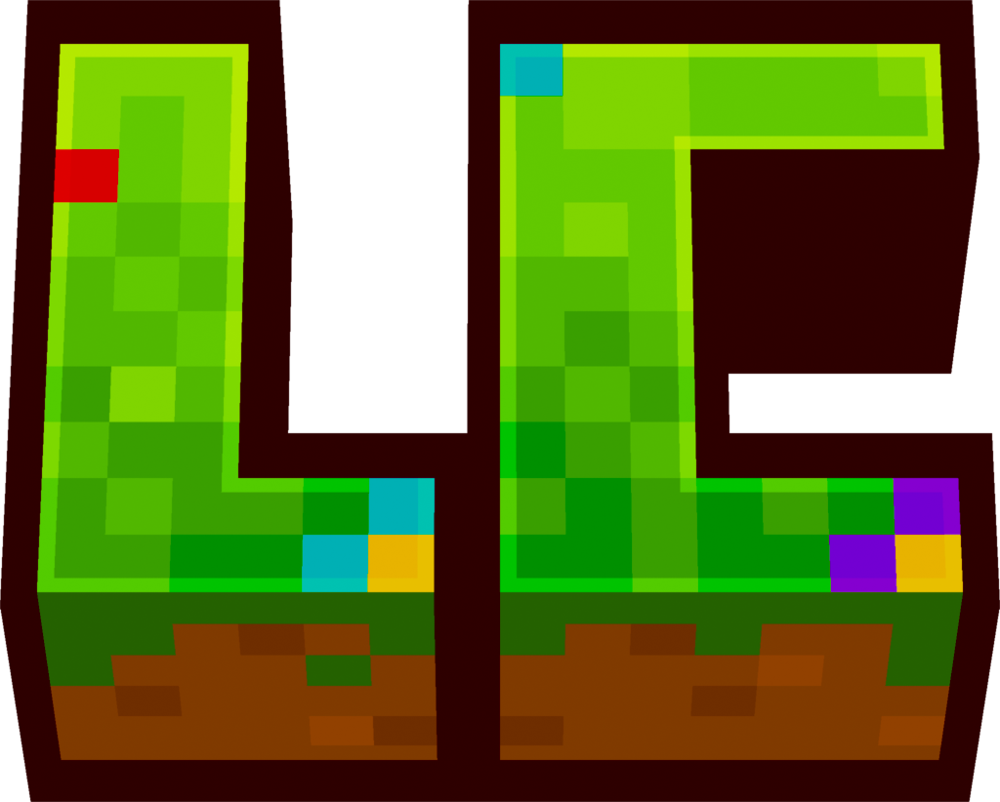
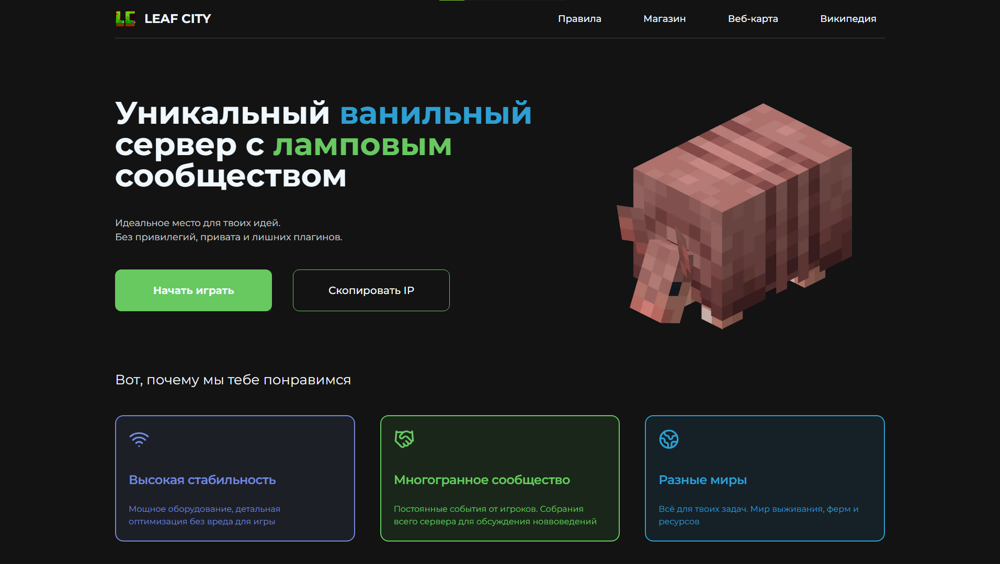
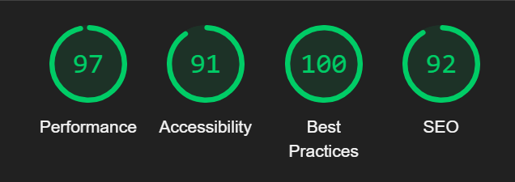

# 
 LEAF CITY

  

  

LEAF CITY - ванильный сервер, нацеленный на выживание и ламповое общение. Игровой процесс на проекте очень многогранный,
ты можешь создать свое локальное сообщество, организовать поселение, продавать свой товар, строить огромные проекты, так
и просто приятно общаться и проводить время

Веб сайт для сервера разработан с 💚 на TypeScript, Next.js, shadcn/ui, Radix UI и Tailwind CSS c использованием
Prettier, ESLint и Husky

## Результат

Ознакомиться с результатом разработки можно по ссылке:

🔗 Открыть [leafcity.ru](https://leafcity.ru/) в новой вкладке

## Статус

## Технический стек

## Баги и ошибки

Нашли баг на сайте? Давайте [решим](https://github.com/evgenykulinich/leafcity/issues) его вместе

## Предложения и обсуждения

Есть предложение по улучшению? Давайте [обсудим](https://github.com/evgenykulinich/leafcity/discussions) вашу идею

[//]: #shields_list (https://simpleicons.org/) 
